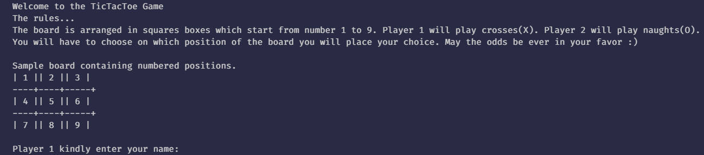
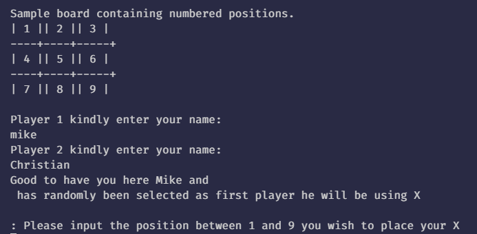
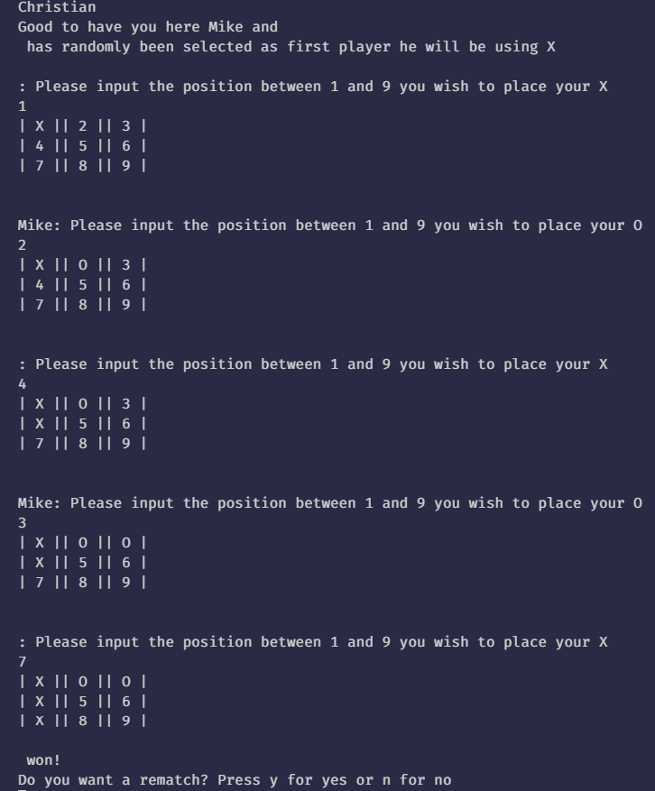

<link rel="stylesheet" href="./src/style/style.css">

# Tic-Tac-Toe

Welcome to Tic Tac Toe.

## About the game

The tic-tac-toe gem can be played by two humans on the command line. The tic-tac-toe board is a 3 X 3 grid and players alternate turns until one player is victorious or the game ends in a draw. Players win by securing three consecutive positions on a row, column, or diagonal. The game ends in a tie if neither player has won and all positions on the board are taken.

## Getting Started

The has been built entirely with the Ruby programming language. It employs the entire object oriented methodholgy aspect of it.

1.First off, clone the game:

```bash

git clone https://github.com/mikenath223/Project-OOP-Tic-Tac-Toe-Game

```

2.Open the terminal from where the folder resides / type in the terminal, the following:

```bash

cd Tic-Tac-Toe-Game

```

3.Inside the bin/main.rb file, you'll find the Tic Tac Toe Interface class, which handles user interactions; inside lib/logic.rb, you'll find Tic Tac Toe Logic, a class which implements all logic of the game.

4.To run the game type:

```bash

bin/main

```

On your command prompt, you'll initialize the game.

## Instructions

<div style="display: flex;flex-direction: column;justify-content:center">

            1. After initializing, you'll be prompted to type two names.
            2. First name corresponds to the fisrt player  and the second, the second.

<span style="display:block;text-align:center"></span>

            3. The players will then get assigned two turn characters to represent their actions on the board.

            4. The player to start will get randomly selected and be assigned 'X'
            5. The second will be assigned 'O'.

<span style="display:block;text-align:center"></span>

            6. After typing your two names, the board will be presented.
            7. The first player will be prompted to type a valid move.
            8. If you try an invalid move, you'll be prompted to type it again. 
            9. Numbers from 1 to 9 are the **only** valid moves.
            10. The win condition is to line up three; either vertically, horizontally or diagonally.

<span style="display:block;text-align:center"></span>

                    Lastly, If no player has won and no available spots remain, the game will be a tie.

</div>

### License

This software is registered under the No-License License.

### Authors

* [Ukeje Michgolden](https://github.com/mikenath223)
* [Christian Otieno](https://github.com/ChristianOtieno)
